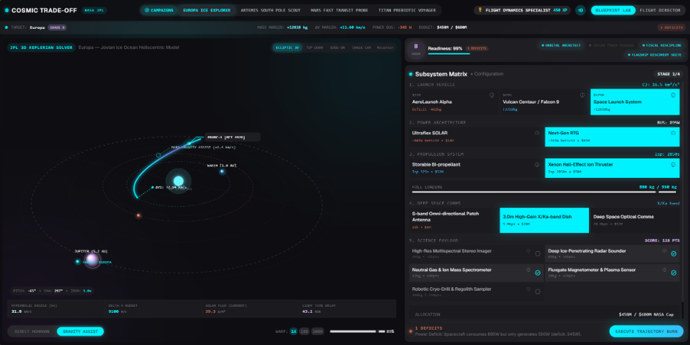
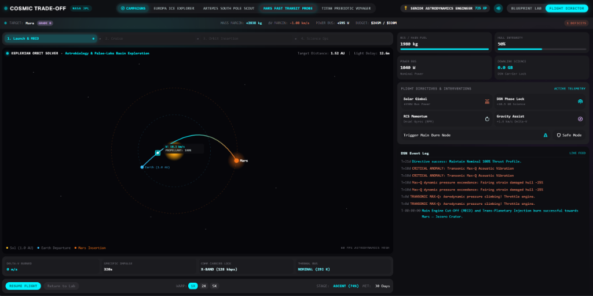
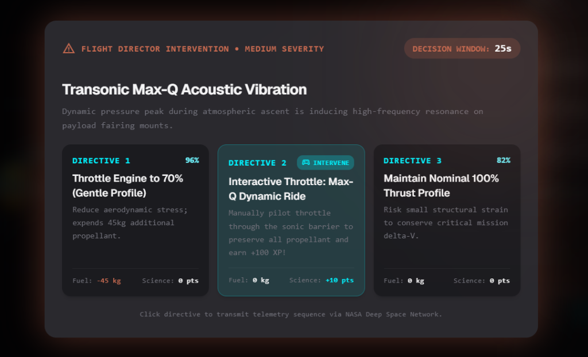
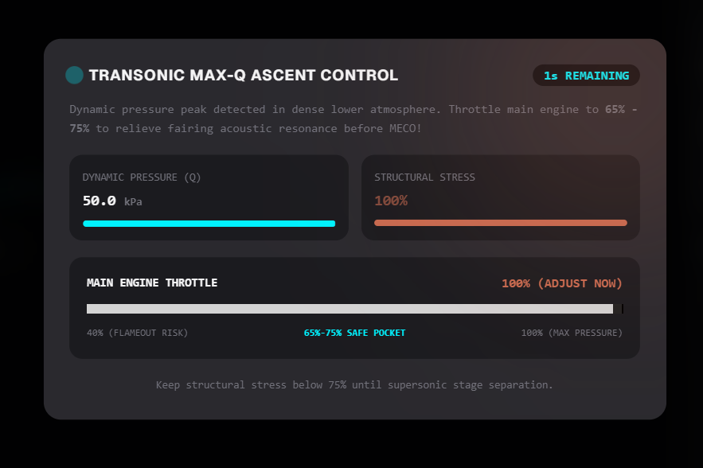
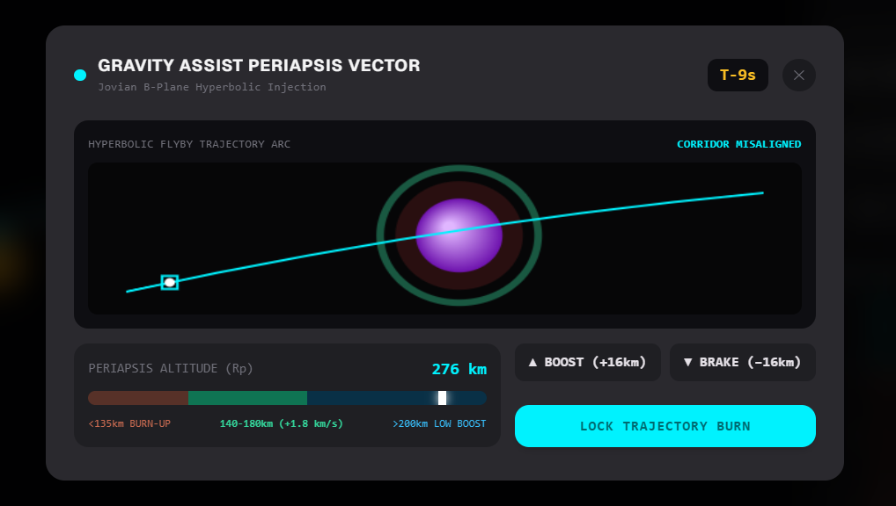
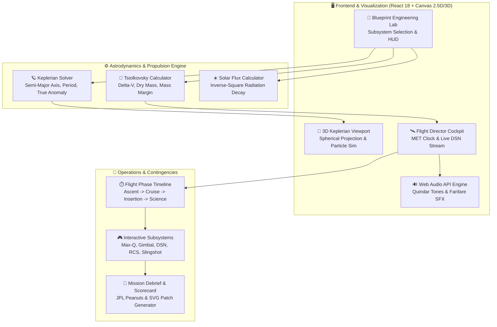

# Cosmic Trade-off — NASA Space Mission Design & Flight Operations Lab

<div align="center">

<!-- Sweetbanner-Inspired Animated Interactive SVG Banner -->
<a href="https://github.com/barnabas47/Cosmic-Trade-off">
  
</a>

<br/>

<p align="center">
  <b>Where deep-space astrodynamics meets high-stakes aerospace trade-off engineering.</b><br/>
  An interactive, zero-scroll mission design laboratory &amp; real-time flight operations cockpit.
</p>

<p align="center">
  <a href="https://github.com/barnabas47/Cosmic-Trade-off/stargazers"></a>
  <a href="https://github.com/barnabas47/Cosmic-Trade-off/releases"></a>
  <a href="https://react.dev/"></a>
  <a href="https://www.typescriptlang.org/"></a>
  <a href="https://vitejs.dev/"></a>
  <a href="https://tailwindcss.com/"></a>
  <a href="LICENSE"></a>
</p>

<p align="center">
  <a href="#-the-problem-the-planetary-exploration-trilemma">The Problem</a> •
  <a href="#-interactive-blueprint-engineering-lab">Blueprint Lab</a> •
  <a href="#-flight-director-operations--in-flight-interventions">Flight Director</a> •
  <a href="#-core-technical-innovations--interactive-minigames">5 Minigames</a> •
  <a href="#-system-architecture--astrodynamic-pipeline">Architecture</a> •
  <a href="#-quickstart--local-setup">Quickstart</a>
</p>

</div>

---

### 📟 Terminal Astrodynamics Readout

```ascii
+---------------------------------------------------------------------------------------------------+
|  [NASA-JPL] DEEP SPACE ASTRODYNAMICS MATRIX                          SOLAR RAD: 39.3 W/m² (EUROPA) |
+---------------------------------------------------------------------------------------------------+
|                                                                                                   |
|               .---.                 _..._                                                         |
|             .'     '.             .'     '.                                                       |
|            /  EARTH  \           /  MARS   \                .--------.                            |
|           |  1.0 AU   |         |  1.52 AU  |              /  EUROPA  \                           |
|            \         /           \         /              |   5.2 AU   |                          |
|             '.     .'             '.     .'                \          /                           |
|               '---'                 '---'                   '--------'                            |
|                 \                     \                          ^                                |
|                  \                     \                         |                                |
|                   `---> [HOHMANN] ------> [GRAVITY ASSIST] ------' [INSERTION]                    |
|                         Δv = 4.2 km/s      Oberth Boost +1.8 km/s   Rp = 160 km                   |
|                                                                                                   |
|   MET: T+493D  |  PROPELLANT: 1980 kg (74%)  |  COMM LOCK: X-BAND 128 kbps  |  BUS TEMP: 292 K   |
+---------------------------------------------------------------------------------------------------+
```

---

## 🏆 Hackathon Submission

- **Hackathon**: [NASA International Space Apps Challenge](https://www.spaceappschallenge.org/)
- **Challenge Track**: *Deep Space Planetary Exploration & Mission Design Game*
- **Live Production Repository**: [https://github.com/barnabas47/Cosmic-Trade-off](https://github.com/barnabas47/Cosmic-Trade-off)
- **Design System**: Google Stitch + 21st.dev Dark Telemetry (Pure 100vh Single-Screen, Zero Window Scroll)
- **Core Technology**: 
  - **Keplerian 2-Body Orbital Solver**: Heliocentric conic trajectory propagation with Hohmann transfers and Oberth-effect gravity assists.
  - **Tsiolkovsky Rocket Matrix**: Wet/dry mass ratio calculation, specific impulse ($I_{sp}$) trade-offs, and delta-V budget margin verification.
  - **HTML5 2.5D/3D Canvas Engine**: Continuous 360° spherical camera orbital rotation with particle-driven RCS/thruster plumes.
  - **Zero-Dependency Web Audio Synth**: Procedural Apollo/Artemis Quindar tones, cryogenic ignition roar, cold-gas bursts, emergency klaxons, and mission control C-Major fanfare.

---

## 💡 The Problem: The Planetary Exploration Trilemma

Deep space exploration is strictly bounded by uncompromising physical and fiscal constraints. Every single kilogram launched beyond Earth orbit incurs exponential fuel and budgetary penalties:

```
                      [ SCIENTIFIC YIELD ]
                        /              \
                       /                \
                      /   ENGINEERING    \
                     /     TRILEMMA       \
                    /                      \
[ PAYLOAD WET MASS ] ———————————————————— [ FISCAL CAP & RELIABILITY ]
```

Airlines and space agencies face three systemic physical barriers:
1. **The Exponential Rocket Equation Barrier**: The Tsiolkovsky relation ($\Delta v = I_{sp} g_0 \ln\frac{m_0}{m_f}$) dictates that adding scientific sensors exponentially swells wet launch mass.
2. **The Inverse-Square Solar Power Void**: Solar irradiance drops with the square of distance ($1/r^2$). At Jupiter/Europa (5.2 AU), solar panels yield less than 4% of their Earth capacity ($39.3\text{ W/m}^2$), forcing painful trade-offs between heavy RTGs or compromised payloads.
3. **The Communication Latency Void**: Round-trip radio signals to Europa take over 80 minutes, rendering manual steering impossible and requiring autonomous flight directives and contingency handling.

---

## 🛡️ The Solution: "Cosmic Trade-off" Mission Design & Flight Cockpit

**Cosmic Trade-off** puts the player in command as **Lead Mission Architect & Flight Director**:

### 🛰️ Interactive Blueprint Engineering Lab
- **1-Click Judge Presets**: Instant loading of validated scenarios (*Europa Ice Explorer*, *Artemis South Pole Scout*, *Mars Fast Transit Probe*, *Titan Prebiotic Voyager*).
- **Subsystem Trade-off Matrix**: Custom hardware configuration spanning Launch Vehicles (Falcon 9, SLS, Vulcan), Propulsion (Storable Biprop, Xenon Ion Hall, Nuclear Thermal), Power Buses, and Science Suites.
- **3D Heliocentric Trajectory Viewport**: Free 360° spatial rotation, dynamic epoch scrubber, and real-time Hohmann vs. Gravity Assist arc projections.



---

### 🕹️ Flight Director Operations & In-Flight Interventions
- **Live Flight Telemetry Deck**: Tracks stage progression (Ascent $\to$ Cruise $\to$ Orbit Insertion $\to$ Science Ops), Mission Elapsed Time (MET), propellant reserves, and real-time Deep Space Network (DSN) downlinks.
- **Contingency Decision Windows**: Anomaly modals with 30-second decision windows and **Directives with interactive minigames** (`INTERVENE` challenges).




---

## 🎮 Core Technical Innovations & Interactive Minigames

| Minigame / Subsystem | Interface & Goal | Screenshot | Operational Impact |
|---|---|:---:|---|
| **Transonic Max-Q Ascent** | Throttle slider keeping dynamic aerodynamic pressure within the 65%–75% safe pocket through Mach 1. |  | Protects payload fairing from acoustic resonance collapse; awards +100 XP. |
| **Gravity Assist Slingshot** | Precision periapsis altitude gauge targeting the hyperbolic flyby corridor (140–180 km). |  | **+1.82 km/s Delta-V boost** with 0 kg fuel expended. |
| **Solar Array Sun Gimbal** | 2-axis polar radar aligning photovoltaic panels with the solar vector. | *Interactive Polar Radar* | **+650W Bus Power**, replenishing emergency storage cells. |
| **DSN Phase Lock Synthesizer** | Live FFT oscilloscope matching carrier frequency and phase to pierce cosmic noise. | *Interactive Wave Oscilloscope* | **+18.5 GB Science downlinked** over deep-space carrier. |
| **RCS Gyro Desaturation** | Attitude horizon stabilization pulsing 4 cold-gas thrusters to bleed reaction wheel RPM below 15%. | *Interactive 3D Horizon Sphere* | Saves propellant and protects gyroscopes from structural redline. |

---

## 🏗️ System Architecture & Astrodynamic Pipeline



---

## 🚀 Quickstart & Local Setup

### Prerequisites
- **Node.js 18+**
- **npm** or **pnpm**

### 1. Clone the Repository
```bash
git clone https://github.com/barnabas47/Cosmic-Trade-off.git
cd Cosmic-Trade-off
```

### 2. Install Dependencies
```bash
npm install
```

### 3. Run the Development Server
```bash
npm run dev
```
Open your browser at `http://localhost:5173`.

### 4. Build Production Bundle
```bash
npm run build
```
Generates a tree-shaken, zero-warning static production build in `dist/`.

---

## 📂 Project Structure

```
Cosmic-Trade-off/
├── public/
│   ├── favicon.svg              # NASA JPL orbital mission favicon
│   └── stitch_screen.png        # Viewport reference asset
├── docs/
│   └── assets/                  # High-resolution screenshots & game HUD captures
│       ├── animated_sweetbanner.svg  # Interactive animated SVG header banner
│       ├── blueprint_lab_3d.png
│       ├── flight_director_sim.png
│       ├── directive_decision_modal.png
│       ├── minigame_max_q.png
│       └── minigame_gravity_assist.png
├── src/
│   ├── components/
│   │   ├── MissionDebriefModal.tsx          # Celebration fanfare, confetti & SVG patch download
│   │   └── stitch/
│   │       ├── CompactMissionHeader.tsx     # Presets, XP, Rank badge, Audio toggle
│   │       ├── CompactTelemetryTicker.tsx   # 36px persistent telemetry strip
│   │       ├── GamifiedMissionScoreHUD.tsx  # Readiness grade & deficit monitors
│   │       ├── Stitch3DAstrodynamicsViewport.tsx # 360° 3D orbital canvas
│   │       ├── StitchSubsystemMatrix.tsx    # Hardware trade-off selector
│   │       ├── SubsystemDetailDrawer.tsx    # Technical inspection drawer
│   │       ├── StitchFlightDirectorView.tsx # Flight cockpit & mission timeline
│   │       ├── FlightAnomalyModal.tsx       # 3-choice emergency intervention dialog
│   │       ├── MaxQAscentMinigame.tsx       # Mach 1 dynamic pressure throttle challenge
│   │       ├── CampaignBriefingModal.tsx    # Story-driven historical campaign briefings
│   │       └── minigames/
│   │           ├── SolarArrayGimbalMinigame.tsx     # 2-axis sun-tracking polar gimbal
│   │           ├── DsnPhaseLockMinigame.tsx         # DSN carrier frequency & phase lock
│   │           ├── ReactionWheelDesatMinigame.tsx   # Cold-gas RCS gyro momentum dump
│   │           └── SlingshotEntryVectorMinigame.tsx # Hyperbolic flyby periapsis targeter
│   ├── data/
│   │   ├── destinations.ts       # Mars, Europa, Titan, Moon celestial physics
│   │   ├── subsystems.ts         # Launchers, engines, instruments, power buses
│   │   ├── presets.ts            # 1-Click Judge scenarios
│   │   └── anomalies.ts          # Contingencies and interactive minigame choice trees
│   ├── physics/
│   │   └── tradeoffs.ts          # Rocket equation & astrodynamic math formulas
│   ├── utils/
│   │   └── audio.ts              # Web Audio API procedural synthesizer
│   ├── types/
│   │   └── mission.ts            # TypeScript interfaces & domain models
│   ├── App.tsx                   # Master root coordinator
│   ├── main.tsx                  # Application entry point
│   └── index.css                 # Custom Tailwind rules & space theme styling
├── package.json
├── tsconfig.json
├── vite.config.ts
├── tailwind.config.js
└── README.md
```

---

## 📄 License
This project is open-source under the **MIT License**. Created for international space exploration hackathons and aerospace STEM gamification.
