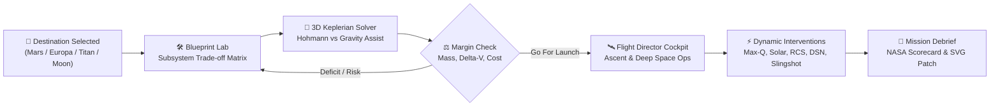
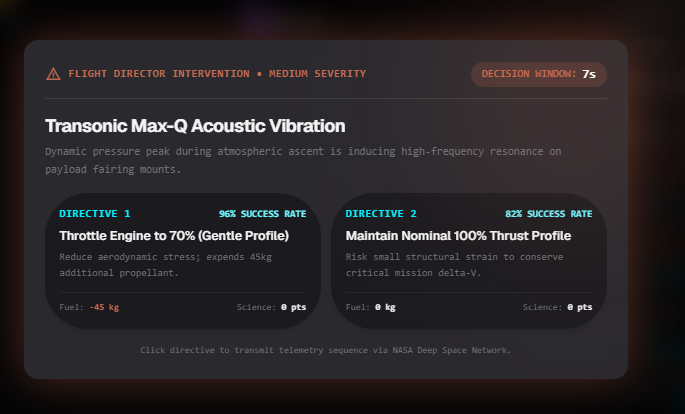
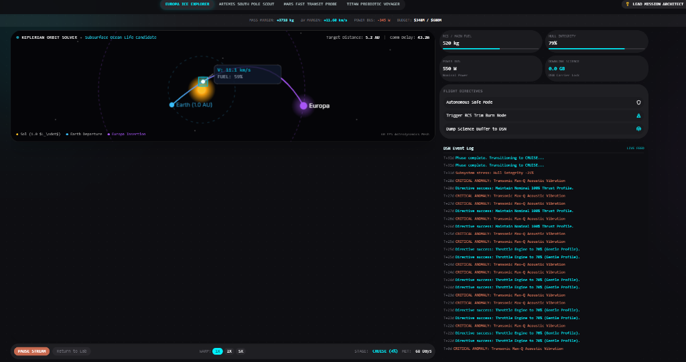
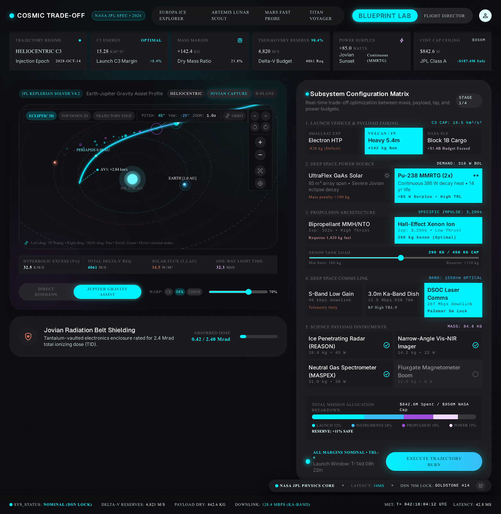
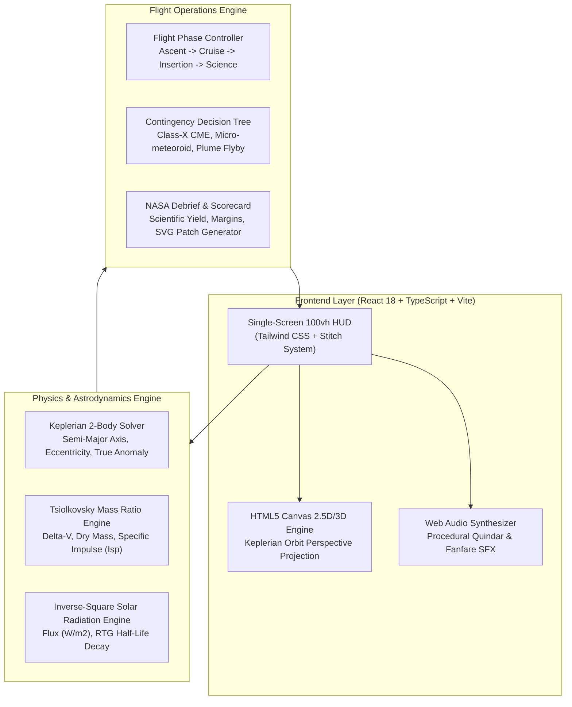

# Cosmic Trade-off — NASA Space Mission Design & Flight Operations Lab

> **Aerospace Engineering Trade-off Simulator & Interactive Astrodynamics Operations Cockpit**  
> Built for the **NASA International Space Apps Challenge** / Global Spaceflight Hackathon.

[](https://react.dev/)
[](https://www.typescriptlang.org/)
[](https://vitejs.dev/)
[](https://tailwindcss.com/)
[](https://developer.mozilla.org/en-US/docs/Web/API/Web_Audio_API)
[](https://github.com/barnabas47/Cosmic-Trade-off)

---

## 🏆 Hackathon Submission Overview

- **Competition**: [NASA International Space Apps Challenge](https://www.spaceappschallenge.org/)
- **Challenge Track**: *Make a Space Biology / Deep Space Planetary Mission Game or Interactive Experience*
- **Repository**: [https://github.com/barnabas47/Cosmic-Trade-off](https://github.com/barnabas47/Cosmic-Trade-off)
- **Live Interactive Demo**: Single-screen 100vh, zero-scroll aerospace simulator designed with **Google Stitch & 21st.dev** design aesthetics.
- **Core Technology**: 
  - Pure Mathematical Astrodynamics Engine: Keplerian 2-body orbit solver, Hohmann transfer delta-v matrices, Oberth gravity-assist vectors, and Tsiolkovsky rocket equation calculations.
  - HTML5 2.5D/3D Perspective Canvas with real-time 360° orbital camera control and particle thruster simulation.
  - Web Audio API procedural sound synthesizer (Apollo/Artemis Quindar tones, cryogenic ignition roars, thruster cold-gas bursts, emergency klaxons, and mission control celebratory fanfare).

---

## 💡 The Problem: The Planetary Exploration Trilemma

Deep space exploration is governed by brutal, non-negotiable physical constraints. Every kilogram sent to Mars, Europa, or Titan costs millions of dollars, while science instruments demand power, communications bandwidth, and thermal shielding:

```
               [ SCIENCE YIELD ]
                 /           \
                /             \
               /   PHYSICAL    \
              /   TRADE-OFF     \
             /    TRILEMMA       \
            /                     \
[ PAYLOAD WET MASS ] —————— [ BUDGET & RELIABILITY ]
```

1. **The Mass vs. Delta-V Penalty**: The Tsiolkovsky rocket equation dictating exponential fuel requirements for high delta-V destinations. Extra instruments add dry mass, diminishing burn duration and orbital margin.
2. **The Power vs. Distance Void**: Solar flux drops with the inverse square of solar distance ($1/r^2$). Solar arrays that produce 1000W at Earth produce barely 40W at Jupiter/Europa, necessitating heavy, costly Radioisotope Thermoelectric Generators (RTGs).
3. **The Communication Latency Barrier**: Deep space light-time delay prevents real-time manual control from Earth (up to 45 minutes round-trip), requiring autonomous safe-mode heuristics and precision orbital timing.

---

## 🛡️ The Solution: "Cosmic Trade-off" Mission Design & Flight Cockpit

**Cosmic Trade-off** puts the player in the seat of a **NASA JPL Mission Architect & Lead Flight Director**, delivering both engineering rigor and dynamic gameplay:

1. **Phase 1: The Blueprint Engineering Lab (System Architecture & 3D Keplerian Solver)**:
   - Configure Launch Vehicles (Falcon Heavy, SLS Block 1B, Starship Expendable), Propulsion (Bipropellant, Ion Hall-effect, Nuclear Thermal), Power Buses (Triple-Junction Solar, Next-Gen Stirling RTG), and scientific instrumentation suites.
   - Interactive 3D Astrodynamics Viewport with continuous 360° orbital rotation, Hohmann vs. Gravity Assist trajectory switching, and dynamic epoch scrubbing.
   - Live NASA Readiness HUD calculating Wet/Dry mass margins, Delta-V deficits, and fiscal cost caps in real time.

2. **Phase 2: Flight Director Simulation Deck (Live Telemetry & In-Flight Interventions)**:
   - High-tempo operations tracking Mission Elapsed Time (MET), stage progression (Ascent $\to$ Cruise $\to$ Insertion $\to$ Science), fuel consumption, and high-gain DSN downlinks.
   - Live Deep Space Network event log and avionics telemetry strip.
   - Seamless contingency triggers with **interactive 3-choice decision cards**.



---

## 🎮 Interactive Subsystem Minigames & Flight Directives

The simulator features 5 fully interactive sub-challenges integrated directly into the flight progression and contingency events:

| Minigame | Subsystem | Mechanic & Goal | Operational Reward |
|---|---|---|---|
| **Max-Q Dynamic Ride** | Aerodynamics & Fairing | Transonic ascent slider keeping dynamic pressure in the 65%–75% safe pocket. | Prevents hull structural collapse, +100 XP. |
| **Solar Array Sun-Tracking Gimbal** | EPS & Solar Arrays | 2-axis polar radar (Azimuth & Elevation) aligning photovoltaic panels with the solar vector. | **+650W Bus Power**, charges critical reserve batteries. |
| **DSN Phase Lock Synthesizer** | High-Gain Telecom | Real-time oscilloscope carrier wave matching frequency & phase shift against cosmic noise floor. | **+18.5 GB Science downlinked** over deep-space carrier. |
| **Reaction Wheel Momentum Desat** | ADCS & Cold-Gas RCS | Attitude horizon sphere stabilization using pulsed cold-gas thrusters to dump gyro RPM below 15%. | Prevents mechanical gyro bearing failure, saves propellant. |
| **Hyperbolic Gravity Assist Slingshot** | Orbital Mechanics | Hyperbolic encounter corridor altitude gauge (Rp 140–180 km) with boost and brake nudges. | **+1.82 km/s Delta-V boost** with 0 kg fuel expended. |

---

## 📸 Screenshots & Cockpit Views

### 1. Blueprint Engineering Lab & 3D Heliocentric Trajectory Viewport


### 2. Flight Director Cockpit & Live Telemetry Deck


### 3. Keplerian Orbit Solver with Interactive Camera


---

## ⚡ Technical Architecture & Engineering Pipeline



### Core Technical Highlights:
- **Zero Window Scroll**: Engineered strictly inside `h-screen overflow-hidden` with responsive CSS grid viewports.
- **Continuous 360° Spherical Orbit Drag**: Free camera yaw and pitch orbital control with window-level mouse binding, allowing unrestricted space inspection.
- **Pure Web Audio Synthesizer**: Zero external audio asset dependencies. All sounds (Quindar tones, Apollo comm clicks, engine roars, celebratory fanfare) are synthesized live in the browser using Web Audio API oscillators, noise buffers, and gain nodes.
- **Vector Mission Patch Generator**: Generates and downloads an official circular SVG mission patch personalized with the user's score, destination, and flight grade.

---

## 🚀 Quickstart & Local Setup

### Prerequisites
- **Node.js 18+**
- **npm** or **pnpm**

### 1. Clone the Repository
```bash
git clone https://github.com/barnabas47/Cosmic-Trade-off.git
cd Cosmic-Trade-off
```

### 2. Install Dependencies
```bash
npm install
```

### 3. Start the Development Server
```bash
npm run dev
```
Open your browser at `http://localhost:5173` (or the port specified by Vite).

### 4. Build for Production
```bash
npm run build
```
Generates an optimized, tree-shaken static production bundle in `dist/`.

---

## 📂 Project Structure

```
Cosmic-Trade-off/
├── public/
│   ├── favicon.svg              # Official NASA-themed orbital favicon
│   └── stitch_screen.png        # Viewport reference asset
├── docs/
│   └── assets/                  # High-resolution screenshots & diagrams
│       ├── hero_blueprint_lab.png
│       ├── flight_director_cockpit.png
│       └── 3d_keplerian_visualizer.png
├── src/
│   ├── components/
│   │   ├── OrbitalVisualizer.tsx          # 2D/3D orbital projection helper
│   │   ├── MissionDebriefModal.tsx        # NASA Scorecard, confetti & SVG patch download
│   │   └── stitch/
│   │       ├── CompactMissionHeader.tsx   # Top navigation, presets & rank XP badge
│   │       ├── CompactTelemetryTicker.tsx # 36px live telemetry feed strip
│   │       ├── GamifiedMissionScoreHUD.tsx# Real-time readiness grade calculation
│   │       ├── Stitch3DAstrodynamicsViewport.tsx # 3D Keplerian canvas simulator
│   │       ├── StitchSubsystemMatrix.tsx  # Engineering hardware trade-off cards
│   │       ├── SubsystemDetailDrawer.tsx  # Progressive disclosure tech specs drawer
│   │       ├── StitchFlightDirectorView.tsx # Flight operations cockpit & event engine
│   │       ├── FlightAnomalyModal.tsx     # 3-choice emergency intervention dialog
│   │       ├── ManeuverBurnMinigame.tsx   # Delta-v trim maneuver minigame
│   │       ├── MaxQAscentMinigame.tsx     # Aerodynamic throttle minigame
│   │       ├── CampaignBriefingModal.tsx  # Story-driven historical campaign briefings
│   │       └── minigames/
│   │           ├── SolarArrayGimbalMinigame.tsx     # 2-axis sun-tracking gimbal
│   │           ├── DsnPhaseLockMinigame.tsx         # DSN carrier frequency & phase lock
│   │           ├── ReactionWheelDesatMinigame.tsx   # Cold-gas RCS gyro momentum dump
│   │           └── SlingshotEntryVectorMinigame.tsx # Hyperbolic flyby periapsis targeter
│   ├── data/
│   │   ├── destinations.ts       # Mars, Europa, Titan, Moon celestial physics data
│   │   ├── subsystems.ts         # Launchers, thrusters, instruments, power buses
│   │   ├── presets.ts            # 1-Click Judge scenarios (Europa, Mars, Titan)
│   │   └── anomalies.ts          # Story contingencies and interactive choice trees
│   ├── physics/
│   │   └── tradeoffs.ts          # Astrodynamic & aerospace trade-off physics formulas
│   ├── utils/
│   │   └── audio.ts              # Web Audio procedural audio synthesizer
│   ├── types/
│   │   └── mission.ts            # TypeScript interfaces and data contracts
│   ├── App.tsx                   # Main root coordinator
│   ├── main.tsx                  # Application entry point
│   └── index.css                 # Custom Tailwind CSS rules & ambient space styling
├── package.json
├── tsconfig.json
├── vite.config.ts
├── tailwind.config.js
└── README.md
```

---

## 🎖️ NASA Mission Directives & Scenarios

Included with **1-Click Judge Scenarios** accessible directly from the header:
- **Europa Ice Explorer**: High radiation, low solar flux ($50\text{ W/m}^2$), extreme delta-V ($5.8\text{ km/s}$) demanding Next-Gen RTGs and Subsurface Ice Penetrating Radar.
- **Mars Sample Return**: High science payload mass budget requiring precision aero-braking and transonic throttle control.
- **Titan Cryo Explorer**: Extreme distance ($9.5\text{ AU}$), methane lakes, high light-time delay requiring high autonomous reliability.
- **Artemis Lunar Base Relay**: Rapid transit, low light-time delay, heavy lunar cargo lander profile.

---

## 📄 License
This project is open-source under the **MIT License**. Created with passion for space exploration and STEM education.
